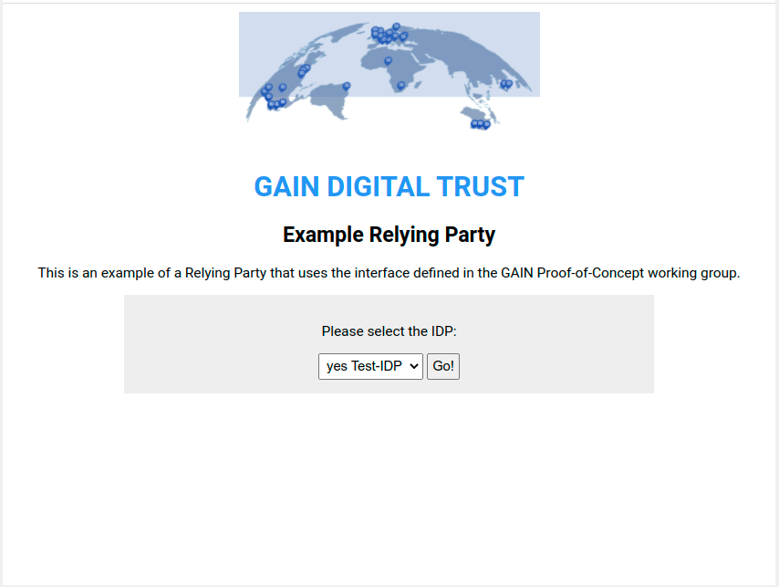

# Examples for the GAIN Ecosystem

This repository contains a working client for the GAIN Proof-of-Concept.



## Setup
```
git clone https://github.com/yescom/gain-examples.git
pip3 install -r requirements.txt
```

## Usage
Set up identity providers and the claims to be requested in `config/gain.yml`. Please find an example file in `config/gain.example.yml`.

Ensure that the key and cert files referenced in the configuration file can be
found - paths are resolved relative to the repository root.

Then run:
```
python3 examples/identity_gain.py
```
... and point your browser to http://localhost:3000/

## Known Issues

BankID seems to set a very tight not-before (NBF) value in the ID token. To
ensure that the example works, ensure that your computer's clock is set
*precisely*! Check at https://time.is